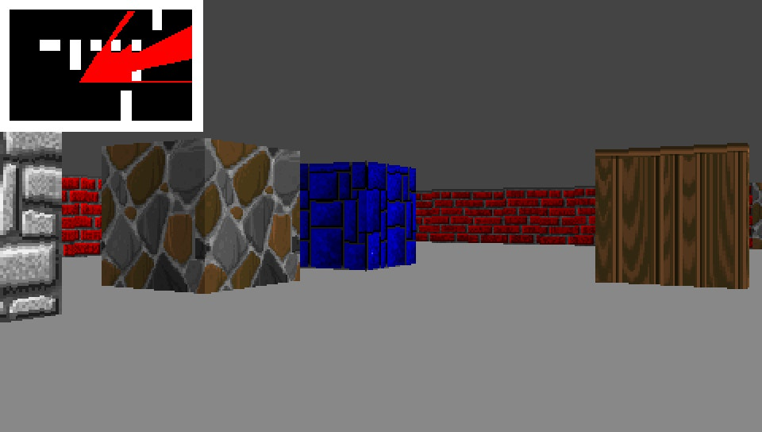

# PSPcaster

A simple raycaster demo for the Sony PSP.

## Notes

This code is not optimized - it runs really slow. There are a lot of points that could be improved, but this is just a proof of concept.

The textures are from Wolf3D, by id software.

## How to build

Clone the [pspdev repository](https://github.com/pspdev/pspdev) and run the steps on its *Up and running* section. Having done that, you should have a PSP build toolchain ready to use.

Then, simply clone this repository and run *make* on its root directory, and you should end up with an *EBOOT.PBP* file, which can be used to run on an emulator like [PPSSPP](https://github.com/hrydgard/ppsspp), or in the real hardware.

## Acknowledgments

- Pikuma, for its great Raycaster course.

- id software, for the Wolfenstein 3D game.

- The devs of the pspdev toolchain.

- Lode Vandevenne and Sean Middleditch for the uPNG lib.